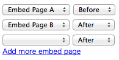

==================
Embed Page Feature
==================

Abstract
========

"Embed Page" is a special page. You cannot access to this page but embed this page to another concrete page.

For example, when you want to add gadget to sidebar area in all pages, you need to add the same gadget manually. It is hard work. And you will trouble when you want to modify gadget information.

"Embed Page" solves this problem. With embed pages, you can create many pages which has common gadgets.

Consideration of Data
=====================

Page
----

Page entity should have a flag to identify whether that page is embed page.

Embed Page
----------

Embed information will be managed in its own entity. It has "belong_page_id", "embed_page_id" and "position".

The "position" takes the following values: "before" or "after".

Gadget
------

No special considerations.

Config
------

Emebed Page information mustn't registered to routing configuration.

Interface
=========

Adding Embed Page
-----------------

Add like the following form to embed page.

Ploting Gadget
--------------

Add a black gadgets to a plot as embed page. The black gadgets can't sort from plot area.

Showing Page
------------

A page loads gadgets which its embed pages have.

Then that page merges gadgets and render them.
